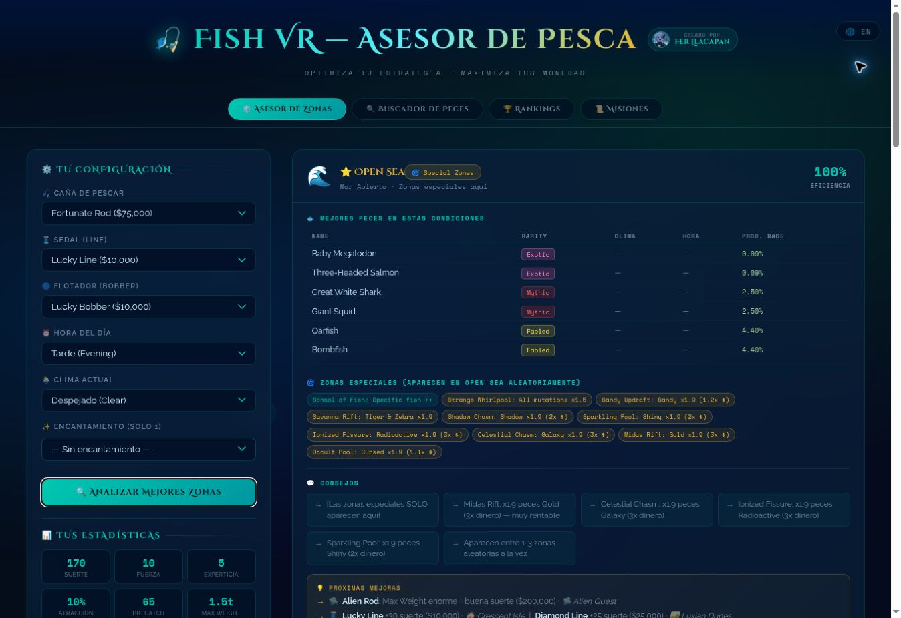
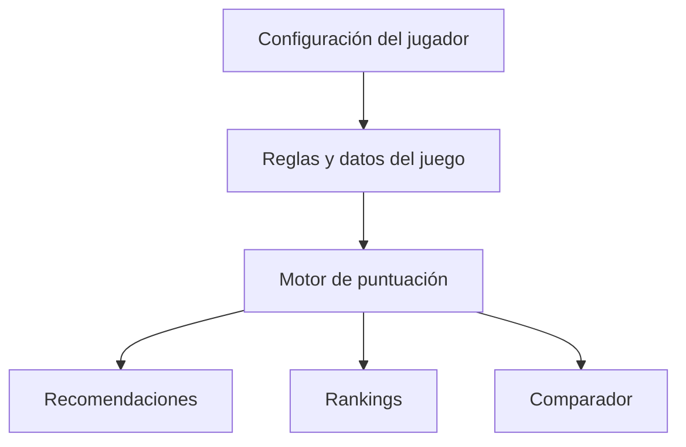

# Fish VR — Fishing Advisor

Asistente web bilingüe para jugadores de **Fish!**, un mundo de pesca de VRChat. La aplicación transforma datos dispersos del juego en recomendaciones prácticas: dónde pescar, qué equipo usar y qué mejora comprar según el objetivo y el presupuesto del jugador.

> Proyecto personal desarrollado por **Fer Llacapan** como una aplicación web estática, sin backend ni dependencias de ejecución.

## Vista del proyecto

<!-- La captura se añadirá en este PR después de validar visualmente la aplicación. -->


## Problema que resuelve

Elegir una combinación de caña, sedal, flotador, encantamiento, zona, clima y horario exige comparar muchas variables. Fish VR reúne esa información en una interfaz única y calcula alternativas para distintos estilos de juego.

## Funcionalidades principales

- **Asesor de zonas:** recomienda lugares de pesca según equipo, clima y hora.
- **Estadísticas de equipamiento:** calcula suerte, fuerza, experticia, atracción, Big Catch y peso máximo.
- **Recomendador de mejoras:** sugiere la compra con mayor impacto dentro de un presupuesto.
- **Buscador de peces:** filtra por nombre, rareza, isla y tipo de agua.
- **Rankings y comparador:** ordena combinaciones por dinero, velocidad, tamaño, rareza, facilidad o equilibrio y permite comparar hasta cuatro configuraciones.
- **Guía de misiones y NPC:** organiza requisitos, recompensas y ubicaciones.
- **Interfaz bilingüe:** contenido disponible en español e inglés.
- **Diseño adaptable:** interfaz utilizable en escritorio y dispositivos móviles.

## Tecnologías

- HTML5 semántico
- CSS3: diseño responsive, Grid, Flexbox, variables, animaciones y estilo glassmorphism
- JavaScript vanilla: filtrado, puntuación, ranking, comparación, traducciones y renderizado dinámico
- Git y GitHub para control de versiones

No utiliza frameworks ni paquetes externos de JavaScript. Google Fonts es el único recurso cargado desde un servicio externo.

## Cómo ejecutarlo

No requiere instalación ni compilación.

```bash
git clone https://github.com/PCastro2001/Fish-VrChat.git
cd Fish-VrChat
```

Después, abre `index.html` en un navegador moderno. Para servirlo localmente también puedes ejecutar:

```bash
python -m http.server 8000
```

Y visitar `http://localhost:8000`.

## Cómo está construido

La versión actual concentra presentación, datos y lógica en `index.html`. Los catálogos del juego se representan como objetos y arreglos de JavaScript. Las funciones de cálculo combinan estadísticas del equipo con el objetivo elegido y las restricciones del jugador; el resultado se renderiza dinámicamente en el navegador.



## Decisiones técnicas

- **Aplicación estática:** reduce la barrera de uso y permite ejecutarla sin cuentas ni servidor.
- **Datos locales:** ofrece respuestas inmediatas y mantiene la herramienta disponible sin una API del juego.
- **JavaScript sin framework:** demuestra dominio directo del DOM, eventos, estructuras de datos y lógica de negocio.
- **Diseño bilingüe:** amplía la utilidad para una comunidad internacional como VRChat.

## Limitaciones conocidas

- Los datos deben actualizarse manualmente cuando cambia el juego.
- No existe persistencia de configuraciones entre sesiones.
- La lógica, los estilos y los datos comparten actualmente un solo archivo de gran tamaño.
- El repositorio todavía no publica una demo mediante GitHub Pages.
- Las recomendaciones son una herramienta de apoyo basada en los datos incorporados, no una integración oficial con Fish! o VRChat.

## Próximos pasos

1. Separar estilos, lógica y datos en módulos mantenibles.
2. Añadir pruebas unitarias para el motor de puntuación.
3. Versionar y documentar la fuente de los datos del juego.
4. Guardar configuraciones favoritas con `localStorage`.
5. Publicar una demo automática con GitHub Pages.

## Autor

**Fer Llacapan** — estudiante de Ingeniería en Informática orientado al desarrollo de software.

- GitHub: [PCastro2001](https://github.com/PCastro2001)
- Perfil del creador en VRChat: enlazado desde la cabecera de la aplicación

## Aviso

Proyecto comunitario no oficial. Fish!, VRChat y sus recursos pertenecen a sus respectivos propietarios.

