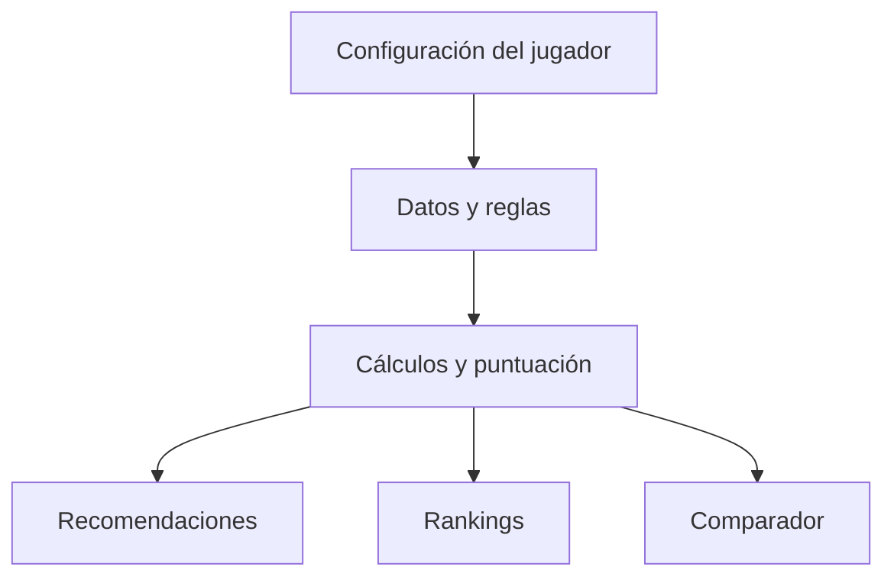

# Fish VR — Fishing Advisor

Asistente web bilingüe para jugadores de **Fish!**, un mundo de pesca de VRChat. Convierte datos dispersos sobre equipamiento, peces y condiciones del juego en recomendaciones comparables según el objetivo y presupuesto del jugador.

> Proyecto personal de **Fer Llacapan**, construido como una aplicación web estática con HTML, CSS y JavaScript vanilla.

## Vista del proyecto


*El asesor combina equipamiento, horario y clima para calcular estadísticas y recomendar zonas y peces.*

## El problema

Elegir dónde pescar y qué equipo comprar obliga al jugador a comparar cañas, sedales, flotadores, encantamientos, zonas, clima y horario. Fish VR centraliza esas variables y las transforma en decisiones: priorizar dinero, velocidad, tamaño, rareza, facilidad o equilibrio.

## Qué construí

- **Asesor de zonas** basado en el equipo y las condiciones seleccionadas.
- **Motor de cálculo** para suerte, fuerza, experticia, atracción, Big Catch y peso máximo.
- **Rankings y comparador** de hasta cuatro configuraciones según distintos objetivos.
- **Recomendador de mejoras** limitado por el presupuesto del jugador.
- **Buscador de peces** con filtros por nombre, rareza, isla y tipo de agua.
- **Guía de misiones y NPC**, interfaz español-inglés y diseño responsive.

## Tecnologías

- **HTML5** para la estructura.
- **CSS3** con Grid, Flexbox, variables y diseño responsive.
- **JavaScript vanilla** para datos, reglas, cálculos, filtros, traducciones y renderizado dinámico.
- **Git y GitHub** para control de versiones.

No utiliza frameworks ni paquetes de JavaScript. Google Fonts es el único recurso externo.

## Cómo ejecutarlo

No requiere instalación ni compilación.

```bash
git clone https://github.com/PCastro2001/Fish-VrChat.git
cd Fish-VrChat
python -m http.server 8000
```

Después, visita `http://localhost:8000`. También puedes abrir `index.html` directamente en un navegador moderno.

## Cómo funciona

Los catálogos del juego se modelan como objetos y arreglos de JavaScript. La aplicación combina la configuración del jugador con reglas locales, calcula estadísticas y puntajes, y renderiza recomendaciones, rankings y comparaciones en el navegador.



## Decisiones y trade-offs

- **Aplicación estática:** facilita el acceso sin cuentas, instalación ni servidor.
- **Datos locales:** entrega respuestas inmediatas ante la ausencia de una API oficial.
- **JavaScript sin framework:** mantiene el prototipo portable y concentra el trabajo en lógica, DOM y eventos.
- **Interfaz bilingüe:** responde a una comunidad internacional como VRChat.

El costo de estas decisiones es que los datos deben actualizarse manualmente, no hay persistencia entre sesiones y la versión actual concentra datos, estilos y lógica en un único archivo.

## Próxima iteración

1. Separar datos, lógica y presentación en módulos.
2. Añadir pruebas unitarias al sistema de cálculo.
3. Versionar y documentar la fuente de los datos.
4. Guardar configuraciones con `localStorage`.
5. Publicar una demo mediante GitHub Pages.

## Autor

**Fer Llacapan** — estudiante de Ingeniería en Informática orientado a Software Engineering y desarrollo Full Stack.

- GitHub: [PCastro2001](https://github.com/PCastro2001)
- Perfil de VRChat: enlazado desde la cabecera de la aplicación

## Aviso

Proyecto comunitario no oficial. Fish!, VRChat y sus recursos pertenecen a sus respectivos propietarios.
